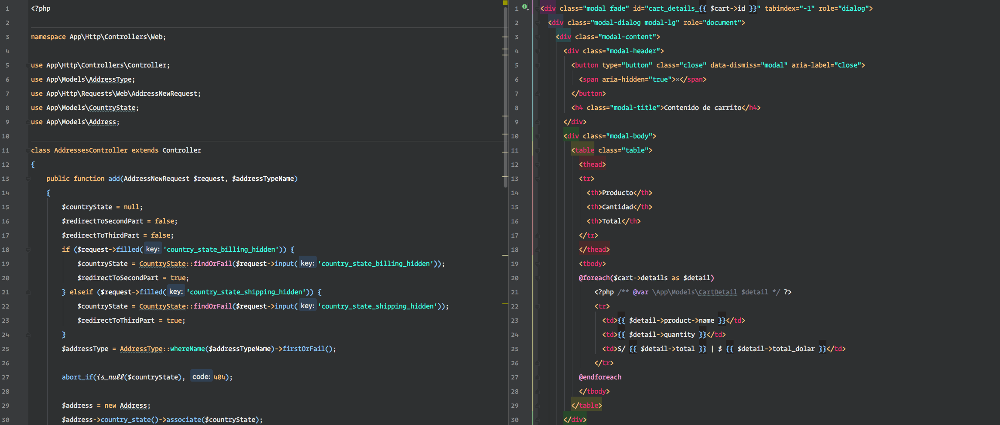

# Panda Syntax Theme for PHPStorm

> A dark [Panda Syntax Theme](http://panda.siamak.work/) for [PHPStorm](http://jetbrains.com/phpstorm).

## Install

### Windows
1. Create a folder called colors inside `C:/Users/{you}/.PHPStorm/config/.`
2. Copy the `.PandaSyntaxPHPStorm.icls` file to the `C:/Users/{you}/.PHPStorm/config/colors/` directory on your local machine.

### Mac 

#### Option 1

1. Create a folder called colors inside `~/Library/Preferences/`.
2. Copy the `.PandaSyntaxPHPStorm.icls` file to the `~/Library/Preferences/colors/` directory on your local machine.
3. Close and re-open PHPStorm.
4. Navigate to `PHPStorm -> Preferences -> Editor -> Color Scheme`.
5. Select "Panda Syntax" from the dropdown menu.
6. Click the “Ok” button to activate the color scheme.

#### Option 2
1. Open PHPStorm and navigate to `Preferences -> Editor -> Color Scheme`.
2. Click the settings cog and Import Scheme....
3. Navigate to PandaSyntaxPHPStorm.icls and apply changes.
4. Close and re-open PHPStorm.

### Linux
1. Create a folder called colors inside ~/.PHPStorm/config/.
2. Copy the `.PandaSyntaxPHPStorm.icls` file to the `~/.PHPStorm/config/colors/` directory on your local machine.
3. Close and re-open PHPStorm.
4. Navigate to `PHPStorm -> Preferences -> Editor -> Colors & Fonts`.
5. Select "Panda Syntax" from the dropdown menu.
6. Click the “Ok” button to activate the color scheme.

## License

[MIT License](./LICENSE)